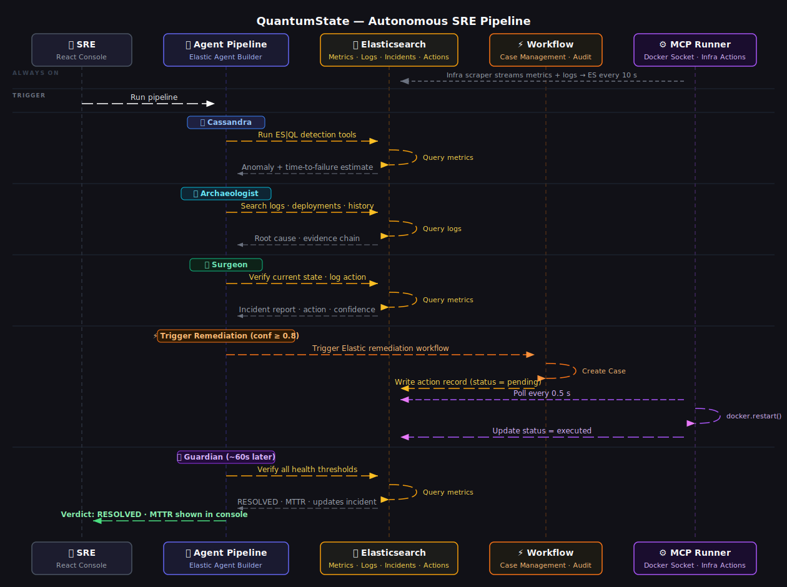

# QuantumState

🌐 [Website](https://www.quantumstate.online) · 🤖 [Agents Definition](agents-definition.md)

---

Incident response today is a three-front problem.

The SRE wakes up at 2 AM to a memory leak. By the time they SSH in, scrape logs, correlate deployment timelines, and find the right runbook, 30 critical minutes are gone.

The AI engineer tasked with automating this hits integration hell. Building agentic workflows on top of Elasticsearch historically meant stitching together LangChain, a vector store, external LLM APIs, and custom orchestration logic into a fragile, high-latency chain.

The security engineer is quietly panicking. Every external AI integration means sensitive production telemetry leaving the cluster for third-party APIs.

The answer was to stop treating Elasticsearch as a data layer and start treating it as the execution environment. The intelligence couldn't sit on top of the data. It had to live inside it.

---

## What It Does

QuantumState is an autonomous incident response system built on Elastic's Agent Builder. Four specialised AI agents handle different phases of an incident lifecycle, and every query and decision happens right where the data sits.

The loop runs like this:

1. **Detect:** Catch metric anomalies before they escalate
2. **Investigate:** Correlate metrics, logs, and past incidents to find the root cause
3. **Execute:** Retrieve the relevant runbook and trigger a fix when confidence is high enough
4. **Verify:** Confirm system health is back to baseline before closing the incident

---

## How It's Built

The swarm runs entirely inside Elastic using Agent Builder. Each agent is equipped with purpose-built tools: parameterised ES|QL queries, ELSER Index Search calls, and Kibana Workflow triggers, giving them native, low-latency access to production telemetry without leaving the cluster.

The four-agent pipeline is orchestrated through the Kibana API over Server-Sent Events, streaming each agent's output to the frontend in real time. All agent logic and credentials remain inside the cluster. No external LLM APIs. No data exfiltration.

A React + TypeScript frontend provides a command centre experience, streaming each agent's output live as the pipeline runs. A local control panel simulates a production-like environment running entirely in Docker, with real services, a metrics scraper, and fault injection controls — built for demo and testing purposes. The full stack is also deployed at [quantumstate.online](https://www.quantumstate.online), with the backend on Railway and the frontend on Vercel, or wired to a local production-like environment.

---

## Four agents, one closed loop

```
Elasticsearch (metrics + logs)
         │
         ▼
┌─────────────────────┐
│  📡 Cassandra        │  Detection: ES|QL anomaly scan, time-to-failure forecast
└──────────┬──────────┘
           │
           ▼
┌─────────────────────┐
│  🔬 Archaeologist    │  Investigation: log search, deployment correlation, historical match
└──────────┬──────────┘
           │
           ▼
┌─────────────────────┐
│  🩺 Surgeon          │  Remediation: runbook retrieval, triggers Elastic Workflow
└──────────┬──────────┘
           │  (autonomous if confidence ≥ 0.8)
           ▼
  ⚡ Remediation executes
  Kibana Case created
  Recovery metrics written
           │
           ▼
┌─────────────────────┐
│  🛡️ Guardian         │  Verification: post-fix metric check, MTTR calc, RESOLVED/ESCALATE
└─────────────────────┘
           │
           ▼
  incidents-quantumstate (closed incident record with MTTR)
```

All four agents are **native [Elastic Agent Builder](https://www.elastic.co/docs/explore-analyze/ai-features/agent-builder/agent-builder-agents) agents** with no external LLM API keys and no external orchestration framework. Everything runs inside your Elastic cluster.


---

## The Agent Swarm

### 🔭 Cassandra: Detect

Continuously monitors system metrics using rolling time windows. Instead of relying on static thresholds, it compares current behavior against a dynamic baseline to detect gradual degradation (memory leaks, error spikes, latency drift) before they escalate into critical failures. Returns anomaly type, confidence score, and time-to-critical estimate.

**Tools:** `detect_memory_leak` · `detect_error_spike` · `calculate_time_to_failure`

### 🔍 Archaeologist: Investigate

Takes the anomaly context and correlates it with surrounding signals: logs, recent deployment events, and historical incidents. Rather than identifying symptoms in isolation, it constructs an evidence chain linking cause to effect. The `find_similar_incidents` tool uses ELSER-powered hybrid search to surface semantically similar past incidents, even when described in completely different language.

**Tools:** `search_error_logs` · `correlate_deployments` · `find_similar_incidents`

### ⚕️ Surgeon: Resolve

Evaluates possible remediation actions based on the detected anomaly and confidence score. Samples current service state, retrieves the most relevant runbook from a semantically searchable procedure library, logs the intended action, then, if confidence is 0.8 or above, calls `quantumstate.autonomous_remediation` directly to trigger the Kibana Workflow. The Workflow creates an audit Case and queues the action for the MCP Runner. Recovery verification is left to Guardian.

**Tools:** `get_recent_anomaly_metrics` · `find_relevant_runbook` · `log_remediation_action` · `verify_resolution` · `quantumstate.autonomous_remediation`

### 🛡️ Guardian: Verify

Closes the loop. After remediation, it validates whether system health has returned to baseline, checking memory, error rate, and latency thresholds. Returns `RESOLVED` or `ESCALATE` with a calculated MTTR. Only when recovery is confirmed does the incident lifecycle complete.

**Tools:** `get_recent_anomaly_metrics` · `verify_resolution` · `get_incident_record` · `get_remediation_action`

---

## The MCP Runner

The MCP Runner is the component that physically executes remediation. It acts as a lightweight sidecar that continuously polls for approved remediation actions written by the agents to Elasticsearch.

When an action is marked ready for execution, the MCP Runner performs the required infrastructure operation: restarting a container, triggering a rollback, or scaling a cache dependency.

- No webhooks
- No external orchestration engines
- No separate automation platform

Elasticsearch acts as the coordination layer and message bus. The MCP Runner bridges agent decisions with real-world execution, keeping the architecture simple, auditable, and fully controlled within the Elastic ecosystem.

---

## Architecture & Pipeline Flow

At a high level, the flow is:

1. Metrics and logs stream continuously into Elasticsearch.
2. The Agent Pipeline orchestrates the four specialized agents.
3. When remediation is approved (confidence ≥ 0.8), an Elastic Workflow is triggered.
4. The Workflow records the action and maintains an auditable trail.
5. The MCP Runner executes the infrastructure action.
6. Guardian verifies recovery and closes the incident.

> Detection → Root Cause → Remediation → Verification → Closure



---

## Setup

### Prerequisites

- Python 3.12+ · Node.js 18+
- Docker (for the real infrastructure demo)
- Elastic Cloud deployment

```bash
git clone https://github.com/padmanabhan-r/QuantumState.git
cd QuantumState
```

### Step 1: Elastic Cloud

Start with a free [14-day Elastic Cloud trial](https://cloud.elastic.co). Once provisioned:

1. From the Elastic Cloud home page, find the **Connection details** section on your deployment and click **Create API key**. Copy the key once generated.
2. In the same panel, open the **Endpoints** tab and toggle **Show Cloud ID**. Copy that value too.

Create a `.env` file in the project root with both values:

```env
ELASTIC_CLOUD_ID=My_Project:base64encodedstring==
ELASTIC_API_KEY=your_api_key_here==
```

The Kibana URL is derived automatically from the Cloud ID. You'll add `REMEDIATION_WORKFLOW_ID` after the next step.

Then enable both features in Kibana. In the left pane, go to **Admin and Settings → Advanced Settings**:

- `workflows:ui:enabled` (Elastic Workflows)
- `agentBuilder:experimentalFeatures` (Elastic Agent Builder)

After saving, reload the page. This is a one-time step. Without it, the workflow deploy and agent setup will fail.

### Step 2: The Indices

QuantumState uses seven specific indices. You don't need to create these manually. They are all created automatically when you run the setup in the next steps. This is just an overview of what gets created and why:

| Index | Purpose |
|---|---|
| `metrics-quantumstate` | Time-series CPU, memory, error rate, latency |
| `logs-quantumstate` | Application logs and deployment events |
| `incidents-quantumstate` | Full incident lifecycle records with ELSER semantic field |
| `agent-decisions-quantumstate` | Agent decision audit trail |
| `remediation-actions-quantumstate` | Action queue polled by the MCP Runner |
| `remediation-results-quantumstate` | Guardian verdicts and post-fix metrics |
| `runbooks-quantumstate` | Semantically searchable remediation procedure library |

### Step 3: Deploy ELSER (Elastic Learned Sparse Encoder)

QuantumState uses ELSER for semantic search across historical incidents and runbooks. Deploy it once:

```bash
python elastic-setup/setup_elser.py
```

This creates the `.elser-2-elasticsearch` inference endpoint on your cluster. If ELSER is already deployed, the script detects this and exits immediately. This step is required before creating agents, as two of the tools (`find_similar_incidents` and `find_relevant_runbook`) use Index Search against ELSER-indexed data, and Kibana validates the indices exist at tool creation time.

### Step 4: Deploy the Remediation Workflow

The workflow must exist before agents are created, as the Surgeon agent requires its ID.

```bash
python elastic-setup/workflows/deploy_workflow.py
```

The script deploys `elastic-setup/workflows/remediation-workflow.yaml` to Kibana and prints the created workflow ID. Add it to `.env`:

```env
REMEDIATION_WORKFLOW_ID=workflow-xxxxxxxx-xxxx-xxxx-xxxx-xxxxxxxxxxxx
```

Alternatively, create the workflow manually in the Kibana UI by importing `elastic-setup/workflows/remediation-workflow.yaml`.

### Step 5: Start the Application and Seed Data

```bash
./start.sh
```

Once running, open `http://localhost:8080` → **Simulation & Setup → Run Setup**. This creates all 7 Elasticsearch indices, including `incidents-quantumstate` and `runbooks-quantumstate` with their ELSER `semantic_text` field mappings, and seeds 100 historical incidents and 8 runbooks in a single pass. Both are required before the next step, as Kibana validates those indices exist at tool creation time.

### Step 6: Create Agents and Tools

```bash
python elastic-setup/setup_agents.py
```

Creates all 13 tools and 4 agents via the Kibana API in a single run. Idempotent, so safe to re-run if you update instructions or tools.

```
── Step 1: Upsert 13 tools ──────────────────────────────
  ✅ detect_memory_leak                    [created]
  ✅ detect_error_spike                    [created]
  ✅ calculate_time_to_failure             [created]
  ✅ search_error_logs                     [created]
  ✅ correlate_deployments                 [created]
  ✅ find_similar_incidents                [created]
  ✅ find_relevant_runbook                 [created]
  ✅ log_remediation_action                [created]
  ✅ verify_resolution                     [created]
  ✅ get_recent_anomaly_metrics            [created]
  ✅ get_incident_record                   [created]
  ✅ get_remediation_action                [created]
  ✅ quantumstate.autonomous_remediation   [created]

── Step 2: Upsert 4 agents ───────────────────────────────
  ✅ cassandra-detection-agent             [created]
  ✅ archaeologist-investigation-agent     [created]
  ✅ surgeon-action-agent                  [created]
  ✅ guardian-verification-agent           [created]
```

If you prefer to set up agents manually, every agent ID, system prompt, tool assignment, and query is documented in [`agents-definition.md`](agents-definition.md).

> **Verify in Kibana after setup.** Once the script completes, open Kibana → Agent Builder and confirm that all 4 agents appear with the correct tools assigned to each. Use [`agents-definition.md`](agents-definition.md) as the reference, which lists every agent's name, system prompt, and exact tool assignments. If anything looks wrong (missing tool, wrong prompt, incorrect ES|QL), edit it directly in the Kibana UI rather than re-running the script, as the UI gives you immediate feedback on what changed.

To tear everything down:

```bash
python elastic-setup/setup_agents.py --delete
```


---

## Injecting Real Faults (Recommended)

The `infra/` directory contains a complete local microservice environment wired together via Docker Compose. Running this stack means the data Cassandra sees is real: actual memory allocation climbing inside a container, actual error logs being written, and an actual `docker restart` bringing memory back down.

```bash
cd infra
docker compose up --build
```

| Container | Port | Purpose |
|---|---|---|
| `payment-service` | 8001 | FastAPI service (memory leak target) |
| `checkout-service` | 8002 | FastAPI service |
| `auth-service` | 8003 | FastAPI service (error spike target) |
| `inventory-service` | 8004 | FastAPI service |
| `auth-redis` | 6379 | Redis dependency |
| `qs-scraper` | - | Polls `/health` every 10s, writes to `metrics-quantumstate` |
| `qs-mcp-runner` | - | Polls `remediation-actions-quantumstate` every 0.5s, runs `docker restart` |

Once up, the scraper immediately starts writing real readings to Elasticsearch. Cassandra has live data to work with.

#### Inject a fault

Use the TUI control panel:

```bash
uv run python infra/control.py
```

Press `1` to inject a memory leak into `payment-service`, `2` for an error spike into `auth-service`, `0` to reset everything.

Or via curl:

```bash
curl -X POST http://localhost:8001/simulate/leak
curl -X POST http://localhost:8003/simulate/spike?duration=600
curl -X POST http://localhost:8001/simulate/reset
```

#### What actually happens

When you inject a memory leak, `payment-service` allocates **4MB every 5 seconds** in real Python heap, not simulated. The scraper writes the rising readings to `metrics-quantumstate`. The container starts emitting error logs immediately on injection, then continues every 30 seconds as memory climbs:

```
ERROR HEAP_PRESSURE: JVM heap elevated: 58%, connection pool under pressure
WARN GC_OVERHEAD: GC overhead limit approaching: 63% heap utilised
CRITICAL OOM_IMMINENT: Out-of-memory condition imminent: 71% heap, GC unable to reclaim
```

These are the logs Archaeologist finds and builds its evidence chain from.

When Surgeon triggers remediation, the MCP Runner stops and restarts `payment-service`. The container is back up in 2–5 seconds. Memory drops back to baseline. The scraper writes the recovered readings. Guardian sees real recovery metrics.

The whole loop, from memory climbing to detection, restart, and recovery, is observable in real infrastructure.

#### Recommended trigger sequence

1. Start the Docker stack (`docker compose up --build` in `infra/`)
2. Wait ~2 minutes for baseline metrics to accumulate
3. Inject a fault via the TUI (`uv run python infra/control.py`)
4. Wait ~60–90 seconds for the fault to appear in the metrics index
5. Open `http://localhost:8080` → Console → **Run Pipeline**

---

## Running the Pipeline

### SRE Console

Click **Run Pipeline** from the Console tab to invoke the full four-agent chain. Each agent's reasoning streams live as it runs. Toggle **Auto Pipeline** to run automatically on a schedule.


### Simulation & Setup

No Docker? The Simulation & Setup page lets you manage the full environment from the browser: create indices, seed data, inject synthetic anomalies, and run the MCP Runner in-process without any containers.


---

## Demo

Here's the full pipeline running against a real memory leak injected into `payment-service`:

<!-- VIDEO: Full pipeline demo -->

1. Memory leak injected: `payment-service` allocates 4MB every 5s, memory climbs from ~42% to ~74%
2. Scraper writes real `/health` readings to `metrics-quantumstate` every 10s
3. Cassandra detects the deviation, calculates ~18 minutes to critical threshold
4. Archaeologist finds three correlated `HEAP_PRESSURE` and `OOM_IMMINENT` log entries
5. Surgeon evaluates confidence (0.91) and calls `quantumstate.autonomous_remediation` directly, triggering the Elastic Workflow
6. The Workflow creates a Kibana Case and writes the action to `remediation-actions-quantumstate`. The MCP Runner picks up the `pending` action within 0.5s and stops and restarts `payment-service`
7. Container restarts in ~3 seconds, memory drops to ~41%
8. Guardian verifies recovery against real post-restart metrics → **RESOLVED. MTTR: ~3m 48s**

The entire incident, from real memory allocation to container restart and recovery, runs end-to-end without any human input.

---

## Tech Stack

| Layer | Technology |
|---|---|
| Agent runtime | Elastic Agent Builder (Kibana) |
| Agent tools | 10 ES\|QL tools + 2 ELSER Index Search tools + 1 Workflow tool (13 total) |
| Workflow automation | Elastic Workflows (YAML, deployed via API) |
| Orchestration | Python FastAPI with SSE streaming |
| Data store | Elasticsearch Cloud |
| Frontend | React + Vite + TypeScript + shadcn/ui |

---

## Project Structure

```
quantumstate/
├── frontend/                   React + Vite + TypeScript UI
│   └── src/
│       ├── pages/              Index, Console, SimControl
│       └── components/         console/, landing/, ui/
├── backend/                    FastAPI Python backend
│   ├── main.py
│   ├── elastic.py              Shared ES client
│   ├── orchestrator.py         Agent Builder SSE streaming
│   └── routers/
│       ├── pipeline.py         4-agent orchestration
│       ├── guardian.py         Post-remediation verification
│       ├── remediate.py        Recovery metric writes
│       ├── sim.py              Simulation control
│       ├── incidents.py        Incident feed + MTTR stats
│       └── health.py           Live service health
├── elastic-setup/
│   ├── setup_elser.py          ELSER inference endpoint deployment (one-time)
│   ├── setup_agents.py         One-shot agent + tool provisioning
│   ├── seed_runbooks.py        Runbook library seeder (8 runbooks)
│   └── workflows/
│       ├── remediation-workflow.yaml
│       └── deploy_workflow.py
├── infra/                      Real Docker microservice environment
│   ├── services/               4 FastAPI services
│   ├── scraper/                Metrics scraper
│   ├── mcp-runner/             Real Docker remediation runner
│   └── docker-compose.yml
├── agents-definition.md        Full Kibana setup reference
├── start.sh                    Starts frontend + backend
└── .env                        Elastic credentials (not committed)
```
