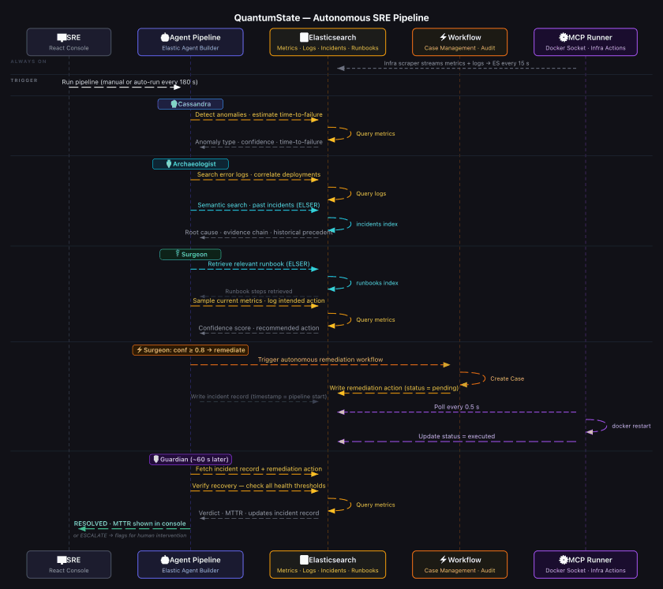

# QuantumState : A Self-Healing Incident Response System

## Contents

- [Problem](#problem)
- [What It Does](#what-it-does)
- [How It's Built](#how-its-built)
- [The Agent Swarm](#the-agent-swarm)
- [The MCP Runner](#the-mcp-runner)
- [Architecture](#architecture)
- [Implementation](#implementation)
  - [Injecting Real Faults](#injecting-real-faults)
  - [Running the Pipeline](#running-the-pipeline)
- [Tech Stack](#tech-stack)
- [License](#license)

---
## Problem

At 3 AM, an SRE wakes up to a slow climb on a memory graph. Incident response is still manual — the anomaly has to be noticed, investigated, traced to a cause, matched to a runbook, and remediated while the clock runs. By the time the first fix lands, 60 minutes of production impact have already passed.

<p align="center"></p>

Automating that process with AI means building on top of the observability stack — and that's integration hell. LangChain, an external vector store, third-party LLM API keys, a custom orchestration layer, stitched together into something more fragile and harder to operate than the manual process it was supposed to replace. And every AI-assisted call ships sensitive production telemetry to an endpoint outside the cluster.

<p align="center"></p>

The intelligence sits on top of the data, far from where decisions need to happen. QuantumState is a demonstration of what becomes possible when you build that intelligence natively inside Elastic — using Agent Builder, ES|QL, ELSER, and Kibana Workflows, without any of the integration overhead.

---

## What It Does

QuantumState is an autonomous incident response system built on Elastic's Agent Builder. When a fault occurs, four specialised AI agents handle the complete lifecycle — detection through verification — without a human in the loop.

The loop runs like this:

1. **Detect:** Catch metric anomalies before they escalate
2. **Investigate:** Correlate metrics, logs, and past incidents to find the root cause
3. **Execute:** Retrieve the relevant runbook and trigger a fix when confidence is high enough
4. **Verify:** Confirm system health is back to baseline before closing the incident

No external orchestration. No third-party APIs. No data leaving the cluster.

---

## How It's Built

The swarm runs entirely inside Elastic using Agent Builder. Each agent is equipped with purpose-built tools: parameterised ES|QL queries, ELSER Index Search calls, and Kibana Workflow triggers, giving them native, low-latency access to production telemetry without leaving the cluster.

The four-agent pipeline is orchestrated through the Kibana API over Server-Sent Events, streaming each agent's output to the frontend in real time. All agent logic and credentials remain inside the cluster. No external LLM APIs. No data exfiltration.

A React + TypeScript frontend provides a command centre experience, streaming each agent's output live as the pipeline runs. A local control panel simulates a production-like environment running entirely in Docker, with real services, a metrics scraper, and fault injection controls — built for demo and testing purposes. The full stack is also deployed at [quantumstate.online](https://www.quantumstate.online), with the backend on Railway and the frontend on Vercel, or wired to a local production-like environment.

---

## The Agent Swarm

<p align="center"></p>

### Cassandra — Detect

Continuously monitors system metrics using rolling time windows. Instead of relying on static thresholds, she compares current behaviour against a dynamic baseline to catch gradual degradation — memory leaks, error spikes, latency drift — before they escalate. Returns anomaly type, confidence score, and time-to-critical estimate, then hands everything off to Archaeologist.

**Tools:** `detect_memory_leak` · `detect_error_spike` · `calculate_time_to_failure`

### Archaeologist — Investigate

Takes the anomaly context and correlates it with surrounding signals: error logs, recent deployment events, and historical incidents. The `find_similar_incidents` tool uses ELSER-powered semantic search to surface past incidents with the same fingerprint — even when described in completely different language. Constructs a full evidence chain and hands it to Surgeon.

**Tools:** `search_error_logs` · `correlate_deployments` · `find_similar_incidents`

### Surgeon — Resolve

Evaluates possible remediation actions based on the anomaly and confidence score. Retrieves the most relevant runbook semantically, samples current service state, and — if confidence clears 0.8 — fires. He calls the Kibana Workflow tool directly. The Workflow creates an audit Case and writes the action to Elasticsearch with `status: pending`. The MCP Runner picks it up from there.

**Tools:** `get_recent_anomaly_metrics` · `find_relevant_runbook` · `log_remediation_action` · `verify_resolution` · `quantumstate.autonomous_remediation`

### Guardian — Verify

Closes the loop. After remediation, he validates whether system health has returned to baseline — checking memory, error rate, and latency thresholds. Returns `RESOLVED` with a calculated MTTR, or `ESCALATE` with full context attached for a human operator.

**Tools:** `get_recent_anomaly_metrics` · `verify_resolution` · `get_incident_record` · `get_remediation_action`

---

## The MCP Runner

<p align="center"></p>

Surgeon doesn't directly touch infrastructure — that's the MCP Runner's job. It polls `remediation-actions-quantumstate` every 500ms for pending actions. When it finds one, it executes the fix — a `docker restart`, a service rollback — marks it `executed`, and moves on. No webhooks, no external orchestration engines, no separate automation platform. Elasticsearch is the coordination layer and message bus.

---

## Architecture

<p align="center"></p>

```
Elasticsearch (metrics + logs)
         │
         ▼
┌─────────────────────┐
│  Cassandra           │  Detection: ES|QL anomaly scan, time-to-failure forecast
└──────────┬──────────┘
           │
           ▼
┌─────────────────────┐
│  Archaeologist       │  Investigation: log search, deployment correlation, ELSER incident match
└──────────┬──────────┘
           │
           ▼
┌─────────────────────┐
│  Surgeon             │  Remediation: ELSER runbook retrieval, triggers Elastic Workflow
└──────────┬──────────┘
           │  (autonomous if confidence ≥ 0.8)
           ▼
  Remediation executes via MCP Runner
  Kibana Case created · Recovery metrics written
           │
           ▼
┌─────────────────────┐
│  Guardian            │  Verification: post-fix metric check, MTTR calc, RESOLVED/ESCALATE
└─────────────────────┘
```

All four agents are **native [Elastic Agent Builder](https://www.elastic.co/docs/explore-analyze/ai-features/agent-builder/agent-builder-agents) agents** — no external LLM API keys, no external orchestration framework. Everything runs inside your Elastic cluster.

<p align="center"></p>

---

## Implementation

If you'd like to follow along with the video guide as you work through this section: [QuantumState - Implementation & Setup Guide](https://www.youtube.com/watch?v=B_hGlWtx6ZI)

### Prerequisites

- Python 3.12+ · Node.js 18+ · [uv](https://docs.astral.sh/uv/getting-started/installation/)
- Docker (for the real infrastructure demo)
- Elastic Cloud deployment

```bash
git clone https://github.com/padmanabhan-r/QuantumState.git
cd QuantumState
uv sync
```

### Step 1: Elastic Cloud

Start with a free [14-day Elastic Cloud trial](https://cloud.elastic.co). Once provisioned:

1. From the Elastic Cloud home page, find **Connection details** and click **Create API key**. Copy the key once generated.
2. In the same panel, open the **Endpoints** tab and toggle **Show Cloud ID**. Copy that value too.

Create a `.env` file in the project root:

```env
ELASTIC_CLOUD_ID=My_Project:base64encodedstring==
ELASTIC_API_KEY=your_api_key_here==
```

The Kibana URL is derived automatically from the Cloud ID. You'll add `REMEDIATION_WORKFLOW_ID` after the next step.

Then enable both features in Kibana under **Admin and Settings → Advanced Settings**:

- `workflows:ui:enabled` (Elastic Workflows)
- `agentBuilder:experimentalFeatures` (Elastic Agent Builder)

After saving, reload the page. This is a one-time step — without it, the workflow deploy and agent setup will fail.

### Step 2: The Indices

QuantumState uses seven indices, all created automatically during setup:

| Index | Purpose |
|---|---|
| `metrics-quantumstate` | Time-series CPU, memory, error rate, latency |
| `logs-quantumstate` | Application logs and deployment events |
| `incidents-quantumstate` | Full incident lifecycle records with ELSER semantic field |
| `agent-decisions-quantumstate` | Agent decision audit trail |
| `remediation-actions-quantumstate` | Action queue polled by the MCP Runner |
| `remediation-results-quantumstate` | Guardian verdicts and post-fix metrics |
| `runbooks-quantumstate` | Semantically searchable remediation procedure library |

> Before running any scripts: `source .venv/bin/activate`

### Step 3: Deploy ELSER

QuantumState uses ELSER for semantic search across historical incidents and runbooks. Deploy it once:

```bash
python elastic-setup/setup_elser.py
```

This creates the `.elser-2-elasticsearch` inference endpoint on your cluster. If ELSER is already deployed, the script detects this and exits. This step is required before creating agents — two tools (`find_similar_incidents` and `find_relevant_runbook`) use Index Search against ELSER-indexed data, and Kibana validates those indices exist at tool creation time.

### Step 4: Deploy the Remediation Workflow

```bash
python elastic-setup/workflows/deploy_workflow.py
```

The script deploys `elastic-setup/workflows/remediation-workflow.yaml` and prints the created workflow ID. Add it to `.env`:

```env
REMEDIATION_WORKFLOW_ID=workflow-xxxxxxxx-xxxx-xxxx-xxxx-xxxxxxxxxxxx
```

Alternatively, create the workflow manually in Kibana by importing `elastic-setup/workflows/remediation-workflow.yaml`.

### Step 5: Start the Application and Seed Data

```bash
cd frontend && npm install && cd ..
./start.sh
```

Once running, open `http://localhost:8080` → **Simulation & Setup → Run Setup**. This creates all 7 indices with their ELSER `semantic_text` field mappings and seeds 100 historical incidents and 8 runbooks in a single pass.

<p align="center"></p>

### Step 6: Create Agents and Tools

```bash
python elastic-setup/setup_agents.py
```

Creates all 13 tools and 4 agents via the Kibana API. Idempotent — safe to re-run if you update instructions or tools.

```
── Step 1: Upsert 13 tools ──────────────────────────────
  ✅ detect_memory_leak                    [created]
  ✅ detect_error_spike                    [created]
  ✅ calculate_time_to_failure             [created]
  ✅ search_error_logs                     [created]
  ✅ correlate_deployments                 [created]
  ✅ find_similar_incidents                [created]
  ✅ find_relevant_runbook                 [created]
  ✅ log_remediation_action                [created]
  ✅ verify_resolution                     [created]
  ✅ get_recent_anomaly_metrics            [created]
  ✅ get_incident_record                   [created]
  ✅ get_remediation_action                [created]
  ✅ quantumstate.autonomous_remediation   [created]

── Step 2: Upsert 4 agents ───────────────────────────────
  ✅ cassandra-detection-agent             [created]
  ✅ archaeologist-investigation-agent     [created]
  ✅ surgeon-action-agent                  [created]
  ✅ guardian-verification-agent           [created]
```

<p align="center"></p>

If you prefer to set up agents manually, every agent ID, system prompt, tool assignment, and query is documented in [`agents-definition.md`](agents-definition.md).

> **Verify in Kibana after setup.** Open Kibana → Agent Builder and confirm all 4 agents appear with the correct tools assigned. Use [`agents-definition.md`](agents-definition.md) as the reference.

To tear everything down:

```bash
python elastic-setup/setup_agents.py --delete
```

### Injecting Real Faults

> **Prerequisites:** Docker must be installed and running.

The `infra/` directory contains a complete local microservice environment wired together via Docker Compose. Running this stack means the data Cassandra sees is real: actual memory allocation climbing inside a container, actual error logs being written, and an actual `docker restart` bringing memory back down.

```bash
cd infra
docker compose up --build
```

| Container | Port | Purpose |
|---|---|---|
| `payment-service` | 8001 | FastAPI service (memory leak target) |
| `checkout-service` | 8002 | FastAPI service |
| `auth-service` | 8003 | FastAPI service (error spike target) |
| `inventory-service` | 8004 | FastAPI service |
| `auth-redis` | 6379 | Redis dependency |
| `qs-scraper` | — | Polls `/health` every 15s, writes to `metrics-quantumstate` |
| `qs-mcp-runner` | — | Polls `remediation-actions-quantumstate` every 0.5s, runs `docker restart` |

#### Inject a fault

Use the TUI control panel:

```bash
uv run python infra/control.py
```

<p align="center"></p>

Press `1` to inject a memory leak into `payment-service`, `2` for an error spike into `auth-service`, `0` to reset everything.

<p align="center"></p>

Or via curl:

```bash
curl -X POST http://localhost:8001/simulate/leak
curl -X POST http://localhost:8003/simulate/spike?duration=600
curl -X POST http://localhost:8001/simulate/reset
```

#### What actually happens

When you inject a memory leak, `payment-service` allocates **4MB every 5 seconds** in real Python heap. The scraper writes the rising readings to `metrics-quantumstate`. The container starts emitting error logs immediately:

```
ERROR HEAP_PRESSURE: JVM heap elevated: 58%, connection pool under pressure
WARN GC_OVERHEAD: GC overhead limit approaching: 63% heap utilised
CRITICAL OOM_IMMINENT: Out-of-memory condition imminent: 71% heap, GC unable to reclaim
```

These are the logs Archaeologist finds and builds its evidence chain from. When Surgeon triggers remediation, the MCP Runner restarts `payment-service` — memory drops back to baseline within seconds. Guardian sees real recovery metrics and closes the incident.

#### Recommended trigger sequence

1. Start the Docker stack (`docker compose up --build` in `infra/`)
2. Wait ~2 minutes for baseline metrics to accumulate
3. Inject a fault via the TUI (`uv run python infra/control.py`)
4. Wait ~60–90 seconds for the fault to appear in the metrics index
5. Open `http://localhost:8080` → Console → **Run Pipeline**

### Running the Pipeline

Click **Run Pipeline** from the Console tab to invoke the full four-agent chain. Each agent's reasoning streams live as it runs. Toggle **Auto Pipeline** to run automatically on a schedule.

<p align="center"></p>

<p align="center"></p>

#### Simulation & Setup (No Docker)

No Docker? The Simulation & Setup page lets you manage the full environment from the browser: create indices, seed data, inject synthetic anomalies, and run the MCP Runner in-process without any containers.

---

## Tech Stack

| Layer | Technology |
|---|---|
| Agent runtime | Elastic Agent Builder (Kibana) |
| Agent tools | 10 ES\|QL tools + 2 ELSER Index Search tools + 1 Workflow tool (13 total) |
| Workflow automation | Elastic Workflows (YAML, deployed via API) |
| Orchestration | Python FastAPI with SSE streaming |
| Data store | Elasticsearch Cloud |
| Frontend | React + Vite + TypeScript + shadcn/ui |

---

## License

MIT © 2026 Padmanabhan Rajendrakumar. See [LICENSE](LICENSE) for details.
